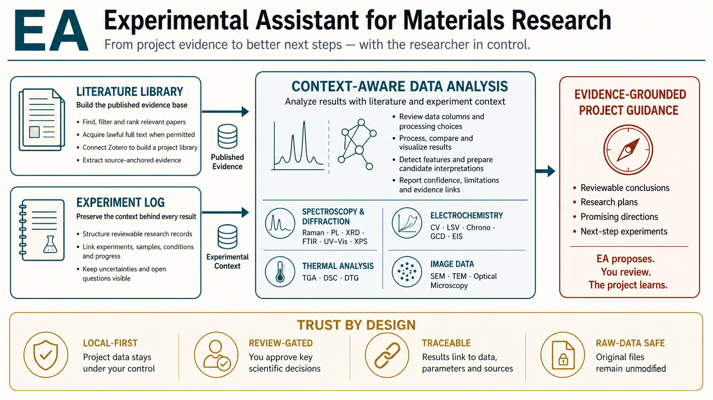
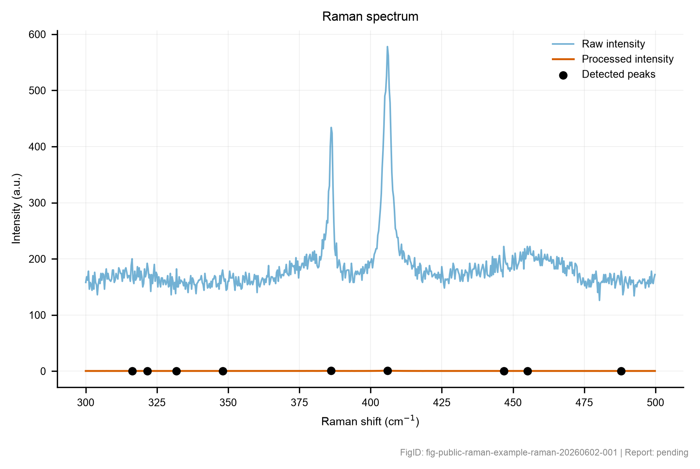
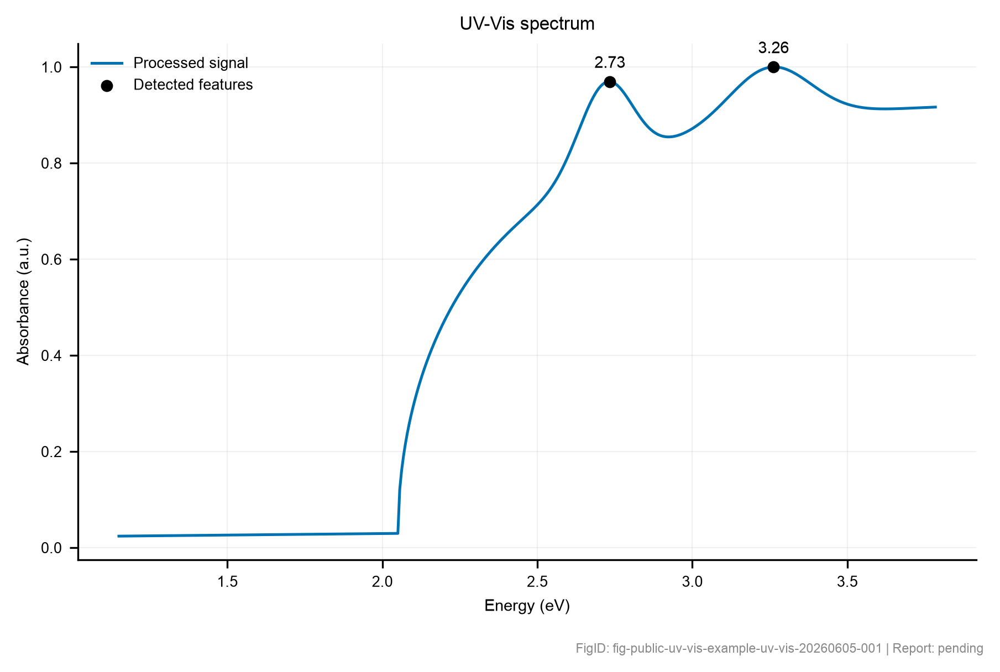
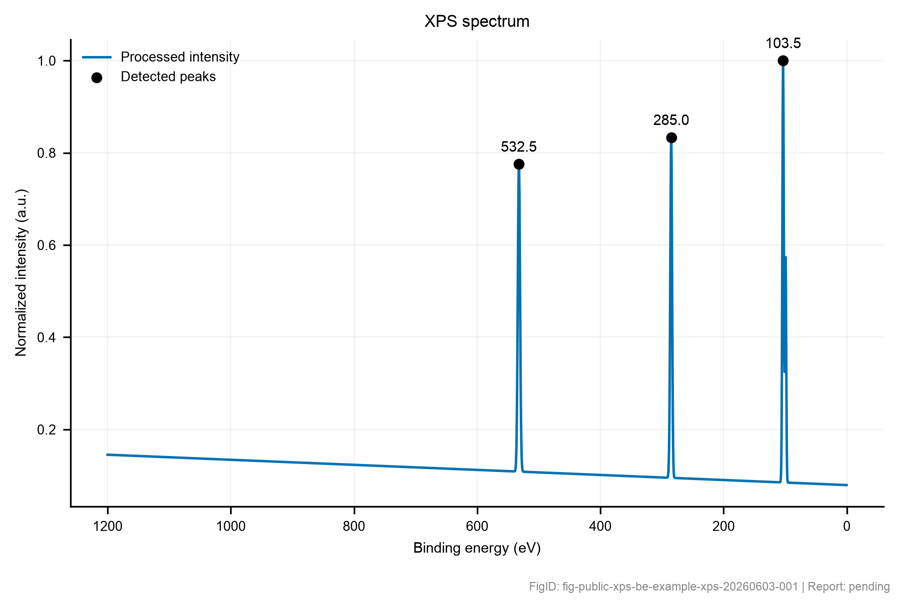

<h1 align="center">Experimental Assistant v1.0.0</h1>

<p align="center">
  <strong>From project evidence to better next steps — with the researcher in control.</strong>
</p>

<p align="center">
  A local-first, review-gated assistant for materials research. Experimental Assistant (EA) organizes experimental context and literature evidence, supports traceable characterization workflows, and produces reviewable reports and next-step candidates without overwriting protected raw data.
</p>

<p align="center">
  <a href="https://github.com/gongchenisbusy/Experimental-Assistant/releases/tag/v1.0.0"></a>
  <a href="https://github.com/gongchenisbusy/Experimental-Assistant/actions/workflows/ci.yml"></a>
  
  <a href="LICENSE"></a>
  
</p>

<p align="center">
  <a href="docs/QUICKSTART_ZH.md">中文快速入门</a> ·
  <a href="#quick-start">Quick Start</a> ·
  <a href="#public-examples">Public Examples</a> ·
  <a href="docs/PUBLIC_INSTALL_AND_CODEX_SKILL_SETUP.md">Installation &amp; Updates</a> ·
  <a href="docs/V1_0_KNOWN_LIMITATIONS.md">Known Limits</a>
</p>

<p align="center">
  
</p>

<p align="center"><sub>Conceptual overview. Exact supported inputs, review requirements, and scientific limits are documented below.</sub></p>

> [!IMPORTANT]
> EA produces reviewable evidence and candidate interpretations. It does not independently prove material identity, phase, mechanism, performance, calibration validity, or exhaustive literature coverage.

## What EA does

| Build the evidence base | Analyze with context | Produce reviewable next steps |
|---|---|---|
| Organize literature, experiments, samples, conditions, uncertainties, and open questions. | Inspect columns, units, processing choices, and experimental context before computation. | Generate reports, figures, candidate interpretations, research plans, and evidence links. |
| Import raw files as controlled, hashed copies and preserve the original source. | Connect reviewed processing to experimental records and source-backed literature candidates. | Keep conclusions, limitations, confidence, and unresolved questions visible for researcher review. |

**EA proposes. You review. The project learns.**

## Quick Start

EA supports Python 3.11, 3.12, and 3.13 on Windows, macOS, and Ubuntu. Python 3.12 is recommended.

```bash
uv tool install --python 3.12 \
  git+https://github.com/gongchenisbusy/Experimental-Assistant.git@v1.0.0

ea setup
ea doctor
```

Restart Codex, open a new task, and invoke the single public skill: `$ea`.

Create a first project by previewing the write, reviewing the proposed location and metadata, and then confirming the same command with `--yes`:

```bash
ea start /path/to/project \
  --name "2D material study" \
  --material "MoS2" \
  --direction "spectroscopic characterization"

ea start /path/to/project \
  --name "2D material study" \
  --material "MoS2" \
  --direction "spectroscopic characterization" \
  --yes

ea journey /path/to/project
```

`ea journey` recovers one concrete next action at a time. For a guided Chinese walkthrough, see [中文快速入门](docs/QUICKSTART_ZH.md). For install, update, rollback, and removal instructions, see [Public Install and Codex Skill Setup](docs/PUBLIC_INSTALL_AND_CODEX_SKILL_SETUP.md).

## How EA works

```text
Project context
      ↓
Preview and protected import
      ↓
Inspect columns, units, and experimental context
      ↓
Researcher reviews scientific choices
      ↓
Process, compare, and prepare candidate interpretations
      ↓
Report, trace, and verify the handoff
```

The ordinary characterization pattern is `inspect → review → process → report`. EA does not silently infer scientific identity, apply unreviewed parameters, or overwrite protected raw data.

### Interaction modes

| Mode | Contract |
|---|---|
| `consult` | Read-only advice, inspection, and previews. |
| `record` | Confirmed project notes and review records, without analysis or report execution. |
| `execute` | Confirmed import, processing, literature, plotting, reporting, and export work. |
| `audit` | Read-only health, provenance, trace, diagnostics, and release checks. |

Run `ea mode` for the exact contract. Mutating commands preview their plans or require explicit confirmation.

## Capabilities at a glance

| Area | Available today | Research boundary |
|---|---|---|
| Project workspace | Project initialization and recovery; experiment, sample, progress, open-item, review, provenance, and memory records. | Findings enter durable memory only after review. |
| Protected data | Encoding and table inspection, controlled raw copies, hashes, duplicate detection, and source protection. | Generated output is never written beneath `raw/`, and source files are not overwritten. |
| Characterization | Review-gated workflows for Raman, PL, XRD, FTIR, UV-Vis, XPS, electrochemistry, thermal analysis, batch work, and structured image records. | Raman preprocessing and peak screening are bounded by the public benchmark. Other method outputs remain candidate or screening results within their documented inputs. |
| Literature evidence | Public metadata discovery and ranking, local source packets, optional acquisition handoffs, and user-defined evidence datasets. | Coverage is query- and source-limited. Full-text access must be lawful and user-authorized. |
| Reports and handoff | Markdown and HTML reports, figures, evidence links, trace views, checksum-verified report and batch bundles. | Checksums verify file integrity, not scientific correctness. |
| Lifecycle and recovery | `doctor`, status, health checks, evaluation, diagnostics, update, rollback, and uninstall previews. | Replacement and removal require explicit confirmation. |

### Characterization entry points

```text
ea raman inspect
ea pl inspect
ea xrd inspect
ea ftir inspect
ea uv-vis inspect
ea xps inspect
ea electrochemistry inspect
ea thermal inspect
```

Detailed processing, review, and reporting commands live in the matching references under [`skills/ea/references/`](skills/ea/references/) and in the [CLI command index](skills/ea/references/cli-command-index.md).

<details>
<summary><strong>Source-backed method discovery and review helpers</strong></summary>

These commands prepare candidates and review packages; they do not silently apply scientific interpretations:

```text
ea ftir list-assignment-libraries
ea uv-vis list-source-libraries
ea uv-vis build-source-packet
ea uv-vis suggest-interpretations
ea uv-vis prepare-review
ea uv-vis propose-memory
ea uv-vis compare-replicates --feature-match-tolerance-ev 0.05
ea xps list-parameter-libraries
```

After a confirmed review, `ea uv-vis report --interpretation-suggestion ...` can include reviewed, registered evidence. Method-specific limits and concrete examples are documented in the workflow references.

</details>

## Public examples

The repository includes public-safe, inspectable projects that require no private data, Zotero account, browser profile, institution login, or literature cache.

<table>
<tr>
<td width="50%" align="center" valign="top">
<a href="examples/public-raman-project/README.md"></a><br>
<strong><a href="examples/public-raman-project/README.md">Raman workflow</a></strong><br>
Controlled raw import, reviewed preprocessing, peak screening, figure, report, and provenance.
</td>
<td width="50%" align="center" valign="top">
<a href="examples/public-ftir-assignment-project/README.md"></a><br>
<strong><a href="examples/public-ftir-assignment-project/README.md">FTIR assignment workflow</a></strong><br>
Source-backed band-assignment candidates, review packages, references, and traceable reporting.
</td>
</tr>
<tr>
<td width="50%" align="center" valign="top">
<a href="examples/public-uv-vis-project/README.md"></a><br>
<strong><a href="examples/public-uv-vis-project/README.md">UV-Vis screening workflow</a></strong><br>
Reviewed optical screening, candidate interpretations, source context, and comparison-ready records.
</td>
<td width="50%" align="center" valign="top">
<a href="examples/public-xps-be-project/README.md"></a><br>
<strong><a href="examples/public-xps-be-project/README.md">XPS binding-energy workflow</a></strong><br>
Reviewed calibration context, binding-energy candidates, source packets, and auditable reports.
</td>
</tr>
</table>

Inspect an example without writing project state:

```bash
ea healthcheck examples/public-raman-project
ea eval project examples/public-raman-project --no-write
```

Copy an example before experimenting with edits. These are orientation artifacts, not templates containing a user's real project memory.

## Literature evidence, with access under your control

EA separates planning, metadata discovery, lawful acquisition, evidence extraction, scientific review, and downstream use. A new project either records literature as enabled or creates a **literature-library decision record** so the choice remains visible.

The public metadata route can use Crossref, OpenAlex, and arXiv when explicitly requested. It records query and coverage state in `public_search_state.yml`; it does not claim exhaustive search or download subscription content.

```bash
ea literature setup-preflight /path/to/project
ea literature plan /path/to/project
ea literature search-public /path/to/project
ea literature rank-candidates /path/to/project
ea literature prepare-source-candidates /path/to/project
ea literature preflight-source-candidates /path/to/project
```

Confirmed method manifests such as `confirmed_ftir_source_candidates.yml`, `confirmed_uv_vis_source_candidates.yml`, and `confirmed_xps_source_candidates.yml` can feed local, reviewable source-packet builders.

EA can also collect a user-defined literature data category through a validated schema. Reported and normalized values remain separate; only accepted or edited records can enter statistics, plots, reports, or exports.

<details>
<summary><strong>Optional acquisition handoff and reconciliation commands</strong></summary>

```text
ea literature institution-access-guide
ea literature zotero-bridge
ea literature import-zotero-status
ea literature reconcile-acquisition
ea literature render-reconciliation
ea literature acceptance-checklist
```

Reconciliation exposes actionable `repair_actions` but does not silently repair records. Zotero, browser, publisher, institution, SSO, MFA, and CAPTCHA operations remain user-authorized and never bypass access controls.

</details>

See [Local Literature Library](skills/ea/references/local-literature-library.md) and [Literature Data Extraction](skills/ea/references/literature-data-extraction.md) for the complete contract.

## Traceable reports and verified handoff

EA keeps compact trace metadata in `traceability/index.yml`. A focused trace connects one report or record to its immediate evidence; an explicit full export writes `traceability/full_trace.yml`.

```bash
ea trace index /path/to/project
ea trace focus /path/to/project REPORT_OR_RECORD_ID
ea trace view /path/to/project --focus REPORT_OR_RECORD_REF
ea trace lookup /path/to/project RECORD_ID
ea trace export /path/to/project --full

ea export report-html /path/to/project --report-id REPORT_ID
ea export report-bundle /path/to/project --report-id REPORT_ID --include-trace --zip
ea export verify-archive /path/to/report-bundle.zip
```

Trace graphs preserve connections to registered references, reference seeds, built-in/source-library refs, review records, provenance, figures, reports, source packets, and reviewed memory.

## Trust by design

| Principle | What it means in EA |
|---|---|
| **Local-first** | Project data, private full text, and local caches stay under the user's control. |
| **Review-gated** | Decisions that change scientific interpretation require explicit review. |
| **Traceable** | Results link back to data, processing choices, reviews, references, and provenance. |
| **Raw-data safe** | Original files remain unmodified; EA processes controlled project copies. |
| **Permission-aware** | Browser, Zotero, institution access, downloads, and diagnostics submission remain opt-in. |
| **Recoverable** | Lifecycle operations preview changes, use atomic writes where applicable, and support documented rollback paths. |

### Scientific and integration boundaries

- EA prepares evidence, screening results, and candidate interpretations for review; it does not autonomously establish material identity, phase, layer count, mechanism, performance, strain or doping, calibration proof, or cross-paper comparability.
- Public literature results are source- and query-limited. Optional full-text workflows must respect publisher terms, access controls, and user authorization.
- Advanced image interpretation, complex PDF/table digitization, and scanned-document OCR may require separately authorized tools and review.
- Release acceptance uses automated tests, public benchmarks, deterministic mock integrations, simulated-agent journeys and reviews, and manual artifact inspection. Simulated evidence is not represented as real-user or independent-expert validation.

Read the [Capability Matrix](docs/CAPABILITY_MATRIX.md), [Known Limitations](docs/V1_0_KNOWN_LIMITATIONS.md), and [Support Promise](docs/V1_0_SUPPORT_PROMISE.md) before using outputs for consequential scientific decisions.

## Everyday project checks

```bash
ea capabilities
ea status /path/to/project
ea healthcheck /path/to/project
ea eval project /path/to/project --no-write
ea brief project /path/to/project
ea diagnostics collect /path/to/project --output /path/to/ea-diagnostics.json
```

Diagnostics remain local by default, redact common secrets and signed/session URLs, and exclude raw data, processed data, private full text, and credential stores.

## Documentation

| Start here | Reference |
|---|---|
| Chinese quick start | [docs/QUICKSTART_ZH.md](docs/QUICKSTART_ZH.md) |
| Full public onboarding | [docs/PUBLIC_ONBOARDING.md](docs/PUBLIC_ONBOARDING.md) |
| Install, update, rollback, removal | [docs/PUBLIC_INSTALL_AND_CODEX_SKILL_SETUP.md](docs/PUBLIC_INSTALL_AND_CODEX_SKILL_SETUP.md) |
| Stable error codes and next actions | [docs/ERROR_CATALOG.md](docs/ERROR_CATALOG.md) |
| Report-bundle verification | [docs/PROJECT_BUNDLE_VERIFICATION.md](docs/PROJECT_BUNDLE_VERIFICATION.md) |
| Release verification and security | [docs/RELEASE_VERIFICATION.md](docs/RELEASE_VERIFICATION.md) · [docs/RELEASE_SECURITY_POLICY.md](docs/RELEASE_SECURITY_POLICY.md) |
| Release notes and history | [docs/V1_0_RELEASE_NOTES.md](docs/V1_0_RELEASE_NOTES.md) · [CHANGELOG.md](CHANGELOG.md) |

## Developers

<details>
<summary><strong>Development and release checks</strong></summary>

```bash
python3 -m pip install -e ".[dev,release]"
python3 -m pytest -q
python3 scripts/validate_skill_packages.py
python3 scripts/check_version_identity.py
python3 scripts/check_downloaded_skill_instructions.py
python3 scripts/check_docs_links.py
python3 scripts/public_release_smoke.py
```

Release policy, reproducibility, SBOM and vulnerability requirements, package checksums, signature trust limits, and clean-build verification are documented in [Release Security Policy](docs/RELEASE_SECURITY_POLICY.md) and [Release Verification](docs/RELEASE_VERIFICATION.md).

</details>

Contributions and security reports are welcome. See [CONTRIBUTING.md](CONTRIBUTING.md), [SECURITY.md](SECURITY.md), [GOVERNANCE.md](GOVERNANCE.md), and the [Support Policy](docs/SUPPORT_POLICY.md).

## License

Experimental Assistant is licensed under [Apache-2.0](LICENSE). See [NOTICE](NOTICE) for attribution information.
