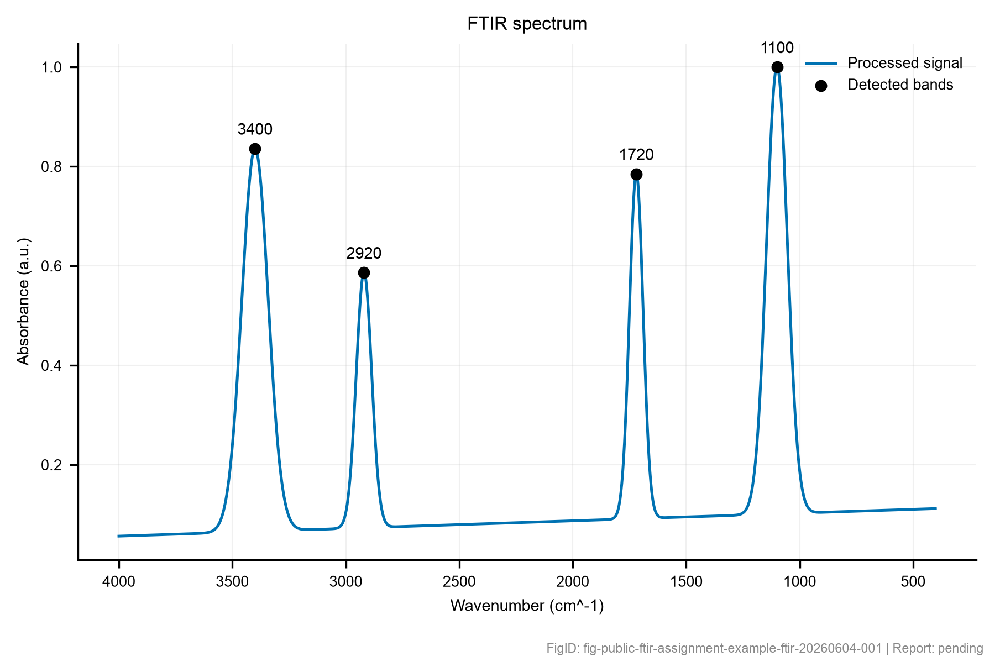

# FTIR 分析报告

## 报告 ID 信息

- report_id: `rpt-public-ftir-assignment-example-20260604-001`
- project_id: `prj-public-ftir-assignment-example`
- result_ids: `res-public-ftir-assignment-example-ftir-20260604-001`
- figure_ids: `fig-public-ftir-assignment-example-ftir-20260604-001`

## 数据来源

本报告基于 FTIR processing result `res-public-ftir-assignment-example-ftir-20260604-001` 生成，关联样品为 `sample-example-polymer-silica-ftir-001`。原始数据、处理结果和图谱路径均通过 provenance 保留。

## 数据列与处理参数

用户确认的 x 列为 `wavenumber`，y 列为 `absorbance`，FTIR x 轴单位记录为 `cm^-1`，信号模式为 `absorbance`。处理参数为 `{'baseline_correction': {'enabled': False, 'method': 'rolling_quantile', 'window_points': 101, 'quantile': 0.05}, 'smoothing': {'enabled': False, 'method': 'savitzky_golay', 'window_length': 9, 'polyorder': 2}, 'normalization': {'enabled': True, 'method': 'max_abs'}, 'peak_detection': {'method': 'scipy_find_peaks', 'prominence': 'auto', 'distance': 'auto', 'max_bands': 12}, 'band_assignment': {'enabled': True, 'source': 'ea.ftir.builtin_band_windows:v0.2'}, 'context_record': {'enabled': False, 'method': 'reviewed_metadata_record', 'source': 'ea.ftir.context_record:v0.2', 'instrument_accessory': {}, 'atmosphere': {}, 'sample_preparation': {}, 'background': {}, 'reference': {}, 'correction_notes': []}}`。

## FTIR context record

当前没有启用或记录 FTIR context record。

## 图谱

原图文件：`processed/sample-example-polymer-silica-ftir-001/ftir/res-public-ftir-assignment-example-ftir-20260604-001/fig-public-ftir-assignment-example-ftir-20260604-001.png`

## 主要观察

自动检峰给出的主要 FTIR band 位于：1100 cm^-1、3400 cm^-1、1720 cm^-1、2920 cm^-1。这些 band 来自自动处理结果，仍需要结合样品制备、背景/空气扣除、ATR 或透射模式、其他表征结果和用户审核进行解释。

## FTIR band 参数

| band_id | wavenumber (cm^-1) | prominence | possible band family | confidence |
|---|---:|---:|---|---|
| ftir-band-004 | 1100 | 0.896 | C-O, C-O-C, Si-O, or fingerprint region | low |
| ftir-band-001 | 3400 | 0.767 | O-H / N-H stretching region | low |
| ftir-band-003 | 1720 | 0.691 | C=O, C=C, amide, or water-bending-adjacent region | low |
| ftir-band-002 | 2920 | 0.511 | aliphatic C-H stretching region | low |

## 可能结论与可信度

- Detected FTIR feature(s) fall in the broad C-O, C-O-C, Si-O, or fingerprint region window; treat this as a screening hint, not a definitive chemical assignment.[1][2]
  - confidence: `low`；evidence bands: `ftir-band-004`；assignment_source: `ea.ftir.builtin_band_windows:v0.2`
- Detected FTIR feature(s) fall in the broad O-H / N-H stretching region window; treat this as a screening hint, not a definitive chemical assignment.[1][2]
  - confidence: `low`；evidence bands: `ftir-band-001`；assignment_source: `ea.ftir.builtin_band_windows:v0.2`
- Detected FTIR feature(s) fall in the broad C=O, C=C, amide, or water-bending-adjacent region window; treat this as a screening hint, not a definitive chemical assignment.[1][2]
  - confidence: `low`；evidence bands: `ftir-band-003`；assignment_source: `ea.ftir.builtin_band_windows:v0.2`
- Detected FTIR feature(s) fall in the broad aliphatic C-H stretching region window; treat this as a screening hint, not a definitive chemical assignment.[1][2]
  - confidence: `low`；evidence bands: `ftir-band-002`；assignment_source: `ea.ftir.builtin_band_windows:v0.2`

## Source-backed FTIR assignment suggestions

- suggestion_record: `suggestions/ftir/suggestion-20260604-001/ftir_assignment_suggestions.yml`；status: `ready_for_user_review`；candidate_count: `4`；auto_applied: `false`。
  - `ftir-builtin-aliphatic-ch-stretching-generic`: aliphatic C-H stretching candidate[2][1]
    - status: `ready_for_user_review`；confidence: `low`；matched bands: `ftir-band-002`；matched wavenumbers cm^-1: `2920.0`
    - source_summary: Standard group-frequency references place aliphatic C-H stretching bands in the 2850-2970 cm^-1 region for many organic materials.
    - applicability: Compare with project chemistry and sample history before interpreting as a real material component.；Check whether binders, solvents, ligands, or handling residues could explain the feature.
    - caveats: Organic contamination and processing residues can produce similar bands.；Band-window match alone is not proof of alkyl groups in the target material.
    - unresolved_reference_ids: `无`
  - `ftir-builtin-carbonyl-co-stretching-generic`: carbonyl C=O stretching candidate[2][1]
    - status: `ready_for_user_review`；confidence: `low`；matched bands: `ftir-band-003`；matched wavenumbers cm^-1: `1720.0`
    - source_summary: Standard group-frequency references place many C=O stretching absorptions in the 1650-1800 cm^-1 region, with position depending strongly on conjugation, hydrogen bonding, and functional group class.
    - applicability: Treat this as a candidate family, not a specific carbonyl environment.；Use project chemistry, neighboring bands, and references to distinguish ester, acid, amide, carbonate, or other carbonyl-like sources.
    - caveats: Water bending, amide bands, C=C modes, and other overlapping bands can affect this region.；The candidate does not identify a specific compound or carbonyl environment by itself.
    - unresolved_reference_ids: `无`
  - `ftir-builtin-oh-nh-stretching-generic`: broad O-H or N-H stretching candidate[2][1]
    - status: `ready_for_user_review`；confidence: `low`；matched bands: `ftir-band-001`；matched wavenumbers cm^-1: `3400.0`
    - source_summary: Standard group-frequency references list broad O-H and N-H stretching absorptions in this high-wavenumber region, with strong overlap from water and hydrogen bonding.
    - applicability: Use only as a broad screening candidate until atmosphere, drying, sample preparation, and chemistry are reviewed.；Broadness and band shape matter; a single maximum is weaker evidence than a reviewed broad envelope.
    - caveats: Moisture, hydrogen bonding, and sample-preparation artifacts commonly affect this region.；This window does not distinguish O-H from N-H without project context and additional evidence.
    - unresolved_reference_ids: `无`
  - `ftir-builtin-sio-stretching-generic`: Si-O or inorganic oxide stretching candidate[2][1]
    - status: `ready_for_user_review`；confidence: `low`；matched bands: `ftir-band-004`；matched wavenumbers cm^-1: `1100.0`
    - source_summary: Standard group-frequency references and common FTIR practice associate strong Si-O or related oxide network stretching bands with the 900-1150 cm^-1 region, but exact positions are system-dependent.
    - applicability: Use project material identity and reference spectra to distinguish Si-O from organic fingerprint bands.；Check whether the sample, substrate, filler, or support contains silica or other oxides.
    - caveats: Organic C-O/C-N fingerprint bands can overlap this region.；This candidate is not a definitive oxide-network assignment.
    - unresolved_reference_ids: `无`
- 上述 FTIR assignment suggestions 是 source-backed advisory records；它们可以帮助组织讨论，但不能单独证明化学组成、功能团归属、反应路径或写入 confirmed memory。

## 谨慎解释

在当前数据范围内，自动 FTIR band family 只能支持“可能功能团或谱区提示”，不能仅凭本次 FTIR 数据直接确认化学组成、键合机制、表面吸附来源或反应路径。相关解释应与已登记文献或参考谱库对应位置共同阅读[1][2]。任何科学解释进入项目记忆前都需要用户审核。

## 不确定性与限制

FTIR signal normalized by processing parameters.

## 输出文件

- processed CSV: `processed/sample-example-polymer-silica-ftir-001/ftir/res-public-ftir-assignment-example-ftir-20260604-001/ftir_processed.csv`
- band table: `processed/sample-example-polymer-silica-ftir-001/ftir/res-public-ftir-assignment-example-ftir-20260604-001/ftir_bands.csv`
- context record: `未生成`
- plot: `processed/sample-example-polymer-silica-ftir-001/ftir/res-public-ftir-assignment-example-ftir-20260604-001/fig-public-ftir-assignment-example-ftir-20260604-001.png`
- metadata: `processed/sample-example-polymer-silica-ftir-001/ftir/res-public-ftir-assignment-example-ftir-20260604-001/ftir_metadata.yml`

## References

[1] Colthup, N. B.; Daly, L. H.; Wiberley, S. E. Introduction to Infrared and Raman Spectroscopy, 3rd ed.; Academic Press, 1990.
[2] Socrates, G. Infrared and Raman Characteristic Group Frequencies: Tables and Charts, 3rd ed.; Wiley, 2001.

## 溯源

本报告草稿引用 FTIR result `res-public-ftir-assignment-example-ftir-20260604-001`，对应 provenance 将在报告生成后写入。
